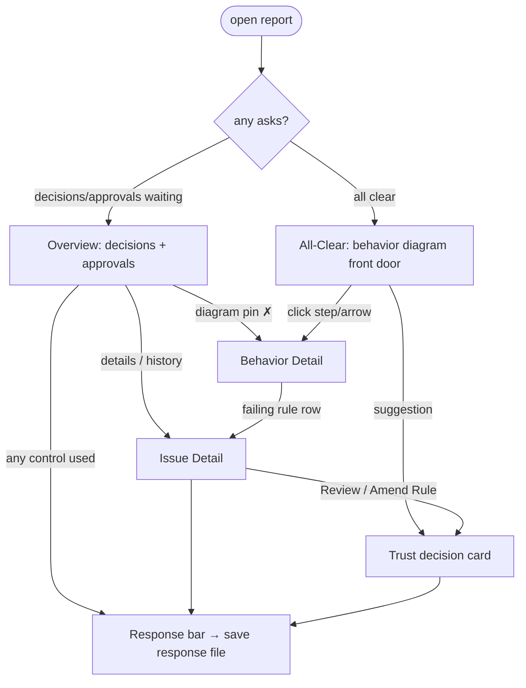

# Model Seed: Archwright Report UI

Compiled at graduation (2026-07-19) from the session's approved artifacts.
Every element cites its ledger anchors (conservation: nothing invented);
active decisions not consumed here are listed under Unconsumed Decisions
(nothing lost). Consumer: the model phase.

## Screen-Flow Graph

- Two overview postures, one page: asks-present vs all-clear [wf-overview#D003, wf-all-clear#D004]
- The behavior diagram is constant across postures; badges change [wf-all-clear#D005]
- Approval→decision reroute via intent-labeled control [wf-issue-detail#D002, wf-issue-detail#D003]
- All interaction terminates in the response file — the only return channel [design-system#D005, wf-overview#D006]

## Per-Screen State and Events

| Screen | Shows (state) | Emits (events) | Anchors |
|--------|---------------|----------------|---------|
| Overview (asks) | verdict counts per ask-type; per-approval contrast pair + recommendation + confidence phrase; per-decision situation + options + marked recommendation; auto-approve setting | approve-fix, choose-option, freeform-response, reveal-rationale, expand bucket | wf-overview#D003, #D005, #D002; design-system#D003, #D004 |
| All-clear | state machine w/ plain labels + per-element verification rollup; unverified disclosure; stability/streaks; suggestions | open behavior detail, open/dismiss suggestion | wf-all-clear#D002, #D003, #D004, #D005; design-system#D006 |
| Behavior detail | step prose + transitions in/out; joined rules w/ status; forces served; folded design story | open rule check detail, unfold design story, next/prev step | wf-behavior-detail#D001, #D002 |
| Issue detail | evidence + code context; goal/design/check chain; recommendation + rationale; history streak | approve-fix, reroute-to-decision, open design note | wf-issue-detail#D001, #D003 |
| Projections (md/json) | markdown mirror of drill hierarchy; canonical JSON + model_view + asks blocks; response-file schema | none (static); response file is the return channel | wf-projections#D001; design-system#D001 |

## Derived Data Requirements (for contract/derive phases)

- `model_view` block: model elements + plain labels + spec-status join [wf-projections#D001, wf-all-clear#D004]
- `asks` block: decisions/approvals/suggestions derivation from violations, ledger candidates, skips [design-system#D003, wf-all-clear#D003]
- Response-file schema: ask-id (reuse aw/v1 fingerprints) → choice/approval/freeform + run identity [design-system#D005, wf-overview#D006]
- Vocabulary map: machine-readable internal→surface term table [design-system#D002]

## Flagged Desires (for the forces phase — not silently created)

- Non-technical readers understand how the app behaves from the report alone [design-system#D006]
- Reports are actionable without archwright literacy [design-system#D002]
- Humans own judgment calls; routine sign-offs may be delegated per-user [design-system#D003, #D004]
- Trust is earned by disclosed limits, not green screens [wf-all-clear#D002]

## Model TODOs (compiled Not-Resolved-Here)

From wf-overview: response-file schema details; auto-approve variable name/scoping; all-green/error/empty states; 100+ approvals; >3-option decisions; keyboard nav; details-target transitions.
From wf-issue-detail: multi-location pager; trace-violation variant (no file:line); chain with missing links; first-run history absence; code-context depth; next/prev keyboard flow.
From wf-all-clear: first-ever run; empty project; multi-actor projects (several machines — front-door composition); 15+-state machines; no-behavior-model projects (front door fallback); SVG accessibility.
From wf-behavior-detail: arrow-vs-step template split; failing-step inheritance of issue content; orphan steps; disclosure depth.
From wf-projections: response versioning/partials/conflicts; per-step file split for large projects; Mermaid vs pre-rendered image in markdown; ask-id stability across runs.
From design-system: print stylesheet; trend display in static reports; warn-color AA values; report ships with core vs separate tool; report's home dir in target projects (`design/report/`?), gitignored or committed.

## Unconsumed Decisions

None — all active entries across the six artifacts are cited above or in the
Graduates-to-Patterns table (design-system#D001 through design-system#D006 table rows; superseded
entries excluded per ledger rules).
