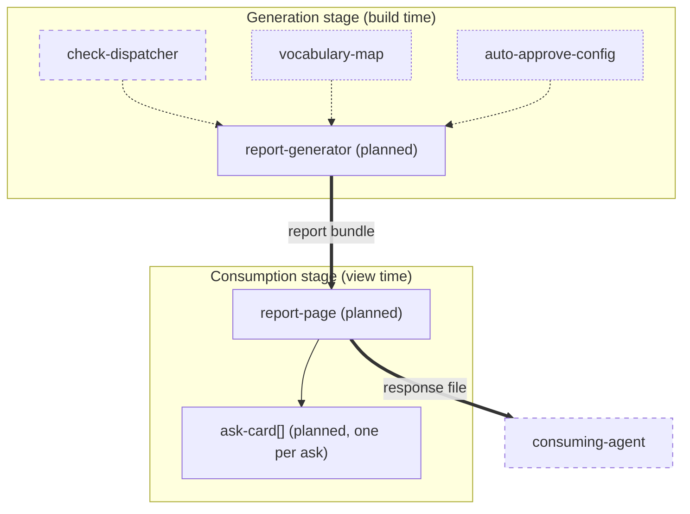
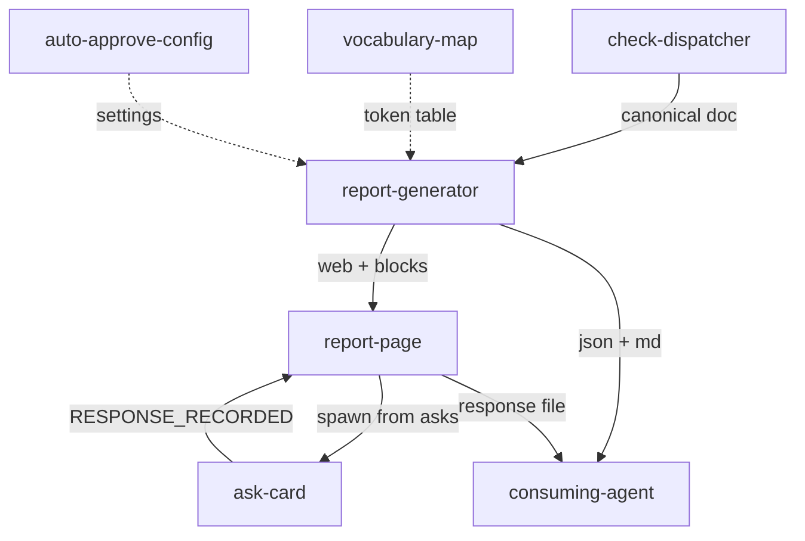
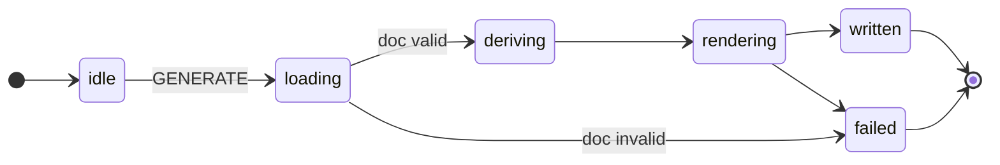
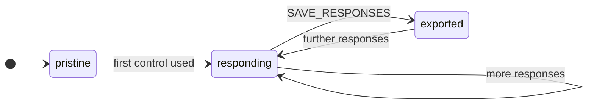
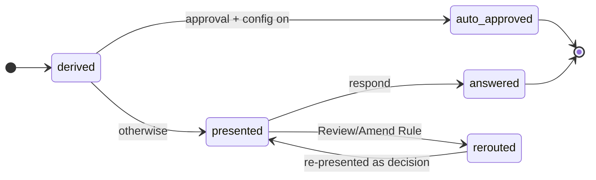
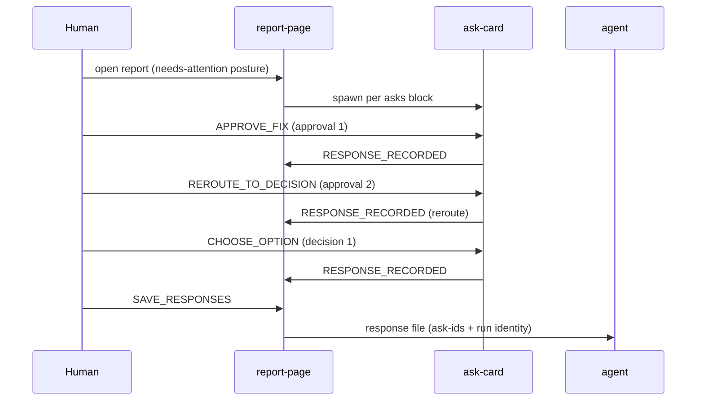
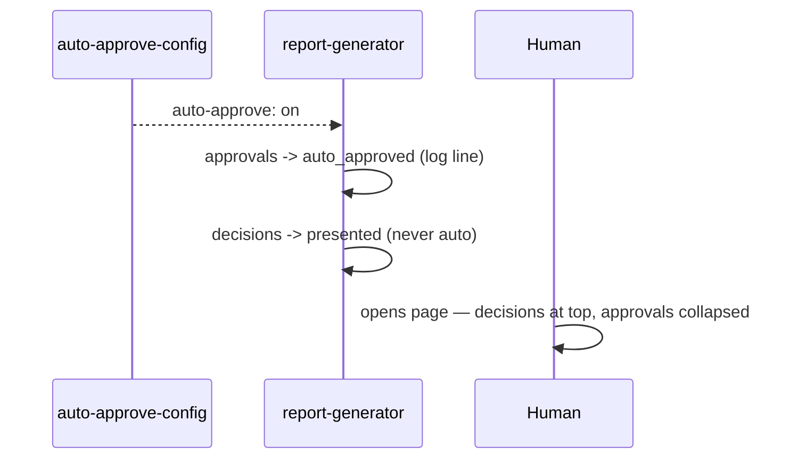

# Report System — Actor Model

Model phase output for ticket 038, consuming `design/discovery/ui/model-seed.md`
(approved seed — anchors carried per element). All actors are **(planned)**: no
implementation exists; every spec projection carries `target_status: pending`
and the derived specs act as acceptance criteria for the build.

Machine-readable projection: [report-actors.yaml](report-actors.yaml).

## Composition

Two temporal stages connected by artifacts, not lifecycle — the generator runs
at build time and exits; the page runs later in a browser. Composition within
each stage is flat (all entities share the stage's lifecycle); `report-page`
spawns one `ask-card` per entry in the asks block at load.

## Event Flows

## State Machines

### report-generator (planned)

| State | Plain label | Notes |
|-------|-------------|-------|
| deriving | working out the asks and the map | posture decided here: all-clear / needs-attention / tool-error / empty-project |
| rendering | building the pages | vocabulary map applied; auto-approve collapses approvals only |

### report-page (planned)

The response bar appears on entering `responding` (wf-overview#D006). Re-export
after further responses produces a superseding file.

### ask-card (planned, spawned per ask)

| Transition | Guard | Source |
|-----------|-------|--------|
| derived → auto_approved | `ask_type == approval AND auto-approve on` — generation-time; **no path exists for decisions or suggestions** | design-system#D004 |
| presented → rerouted | approvals only; the reroute is itself a recorded response | wf-issue-detail#D002/#D003 |

## Key Scenarios

### Needs-attention: respond and export

Exercises: every interaction lands in the responses map; reroute is recorded;
one file carries everything (in-report-response-capture).

### Auto-approve on: decisions still wait

Exercises: the hard floor (`hitl-hard-floor`) survives any configuration.

## Boundary Decision Table

| Entity | Decision | Heuristic |
|--------|----------|-----------|
| report-generator | Separate actor | Independent lifecycle (build-time), owns posture + derived blocks, single writer of the bundle |
| report-page | Separate actor | Independent lifecycle (view-time), owns response state, event communication with ask-cards |
| ask-card | Spawned child actor | Per-item independent state (answered/rerouted independently); same pattern as per-slot controllers |
| vocabulary-map | Configuration authority | Immutable reference data, no transitions; consumed by generator |
| auto-approve-config | Configuration authority | Immutable per-run reference; read at generation |
| check-dispatcher | Boundary service | Existing external tool; produces the canonical doc; no report-domain state |
| consuming-agent | Boundary service | External consumer of artifacts; out of model scope |

## Model Decisions (structural completions handed down by patterns)

Both flagged by `behavior-first-front-door` → Consequences; confidence — (advisory, revisit on field evidence).

1. **No-behavior-model front door** (wf-all-clear Not-Resolved): when the target
   project has constraint/dependency rules only, the front door falls back to the
   **promise-grouped list** — passing rules rolled up under the product goal they
   protect, goal phrasing as row title. This is the superseded wf-all-clear#D001
   direction, retained as the degraded mode: it preserves plain language and
   goal-orientation without requiring a state machine. The page states plainly
   that no behavior map exists yet.
2. **Multi-actor front door** (wf-all-clear Not-Resolved): several state machines
   render as a **composition view first** — the actor/system diagram (who talks
   to whom) with per-actor verification rollups as badges; clicking an actor
   opens its own state machine as the standard front door. Precedent: the
   reconciliation pass's `system-overview.md` composition diagram (grill Q06
   deliverable). One machine = that machine directly; N machines = composition
   then drill.

## Key Invariants (input to derive)

| # | Invariant | Actors | Pattern |
|---|-----------|--------|---------|
| 1 | Every surface datum exists in the canonical JSON (pure projection) | report-generator | canonical-doc-projections |
| 2 | Every ask-source signal maps to exactly one ask-type | report-generator | three-ask-types |
| 3 | `ask_type == decision` has no path to auto-approved | ask-card | three-ask-types |
| 4 | Suggestions never block the verdict, never auto-execute | ask-card, report-generator | three-ask-types |
| 5 | No network I/O in the page; opens from file:// | report-page | static-report-response-file |
| 6 | Every control interaction is recorded before anything else; export carries run identity | report-page | static-report-response-file |
| 7 | Needs-attention renders the same diagram with badges — never a separate list-only view | report-generator | behavior-first-front-door |
| 8 | All-clear with skips/baseline entries renders disclosure sections | report-generator | honest-all-clear |
| 9 | Every surface phrase for an internal term comes from the vocabulary map | report-generator | plain-surface-progressive-disclosure |

## Conventions

- **Report home**: `design/report/` in the target project, **gitignored** —
  the bundle is regenerable output (like build artifacts); the response file
  lands there as an inbox the agent consumes. Committing regenerable surfaces
  would create merge noise and a second source of truth (violates invariant 1's
  spirit). Response files are point-in-time answers — after consumption they're
  stale; history lives in what the agent did with them.

## Seed TODO Triage (nothing lost)

| Seed TODO | Disposition |
|-----------|-------------|
| Response-file schema details (versioning, partials, staleness) | **Deferred → contract phase** (ticket 038 scope) |
| Auto-approve variable name/scoping | **Deferred → contract phase** (config surface of contract:asks-block / generator config) |
| All-green / error / empty states | **Consumed** — generator posture enum: all-clear, needs-attention, tool-error, empty-project |
| Ask-id stability across runs | **Deferred → contract phase** (aw/v1 fingerprint reuse direction, contract:response-file) |
| No-behavior-model front door | **Consumed** — Model Decision 1 (promise-grouped fallback) |
| Multi-actor projects (several machines) | **Consumed** — Model Decision 2 (composition view first) |
| First-ever run (no history) | **Consumed (partially)** — history sections render "first run" honestly; detail styling → derive/implementation |
| Details-target transitions (inline vs anchor) | **Consumed** — in-page anchor sections (wireframe comments; flow edges in YAML) |
| 100+ approvals; >3-option decisions; 15+-state machines; long prose | **Deferred → implementation** (rendering scale variants; no structural impact) |
| Keyboard nav; SVG accessibility; disclosure depth; fold animation; scroll restore | **Deferred → implementation** (feel-finish concerns; status-never-color-alone already a hard force) |
| Multi-location pager; trace-violation variant; chain missing links; code-context depth | **Deferred → derive** (issue-detail rendering variants — noted in constraint/contract descriptions) |
| Arrow-vs-step template split; failing-step inheritance; orphan steps | **Deferred → derive** (behavior-detail rendering variants) |
| Response versioning/partials/conflicts | **Deferred → contract phase** (response-file schema) |
| Per-step file split for large projects; Mermaid vs pre-rendered image in md | **Deferred → implementation** (projection mechanics; canonical structure unaffected) |
| Print stylesheet; trend display; warn-color AA values | **Deferred → implementation / needs data decision** (design-system Not-Resolved carried) |
| Report ships with core vs separate tool | **Deferred → open** (packaging decision — not structural; flag at digest) |
| Report home dir | **Consumed** — Conventions above (`design/report/`, gitignored) |
