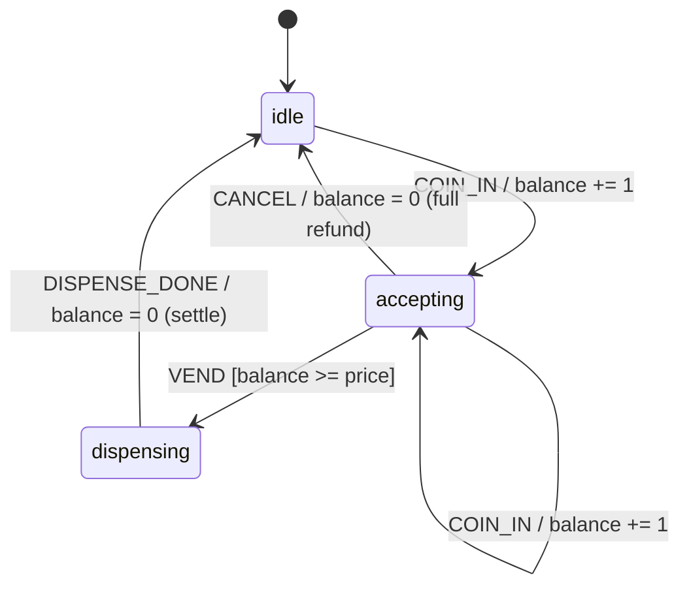
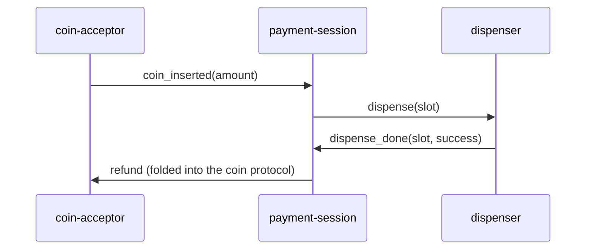

# Snackbox Domain Model

Human-readable half of [snackbox.yaml](snackbox.yaml), from `pattern:payment-gate`.

## Actors

| Actor | Owns | Role |
|-------|------|------|
| `payment-session` | `balance`, `selected_slot` | The authority. Runs the session state machine; sole writer of balance; the guarded VEND transition IS the payment gate. |
| `dispenser` | `motor_running` | Dumb servant. Accepts `dispense(slot)`, runs the motor, reports `dispense_done`. Knows nothing about money. |

**Boundary entities:** `coin-acceptor` (hardware — produces `coin_inserted`, pays out refunds) and `kiosk-ui` (renders session state, raises SELECT/VEND/CANCEL intents; writes nothing).

## Session state machine

The two ★★ invariants live on this machine (checked in `behavior:purchase-session`):

- **paid-when-dispensing** — `dispensing` is reachable only through the guard.
- **idle-holds-no-money** — every path back to `idle` settles the balance.

## Event flows

## Contract candidates → specs

| Candidate | Producer | Disposition |
|-----------|----------|-------------|
| `dispense` | payment-session | `contract:dispense-command` (protocol cluster with `dispense_done`) |
| `dispense_done` | dispenser | folded sibling in `contract:dispense-command` |
| `coin_inserted` | coin-acceptor (boundary producer) | `contract:coin-events` |
| `refund` | payment-session | `folded_into: coin_inserted` — mirror leg of the cash-flow protocol |
