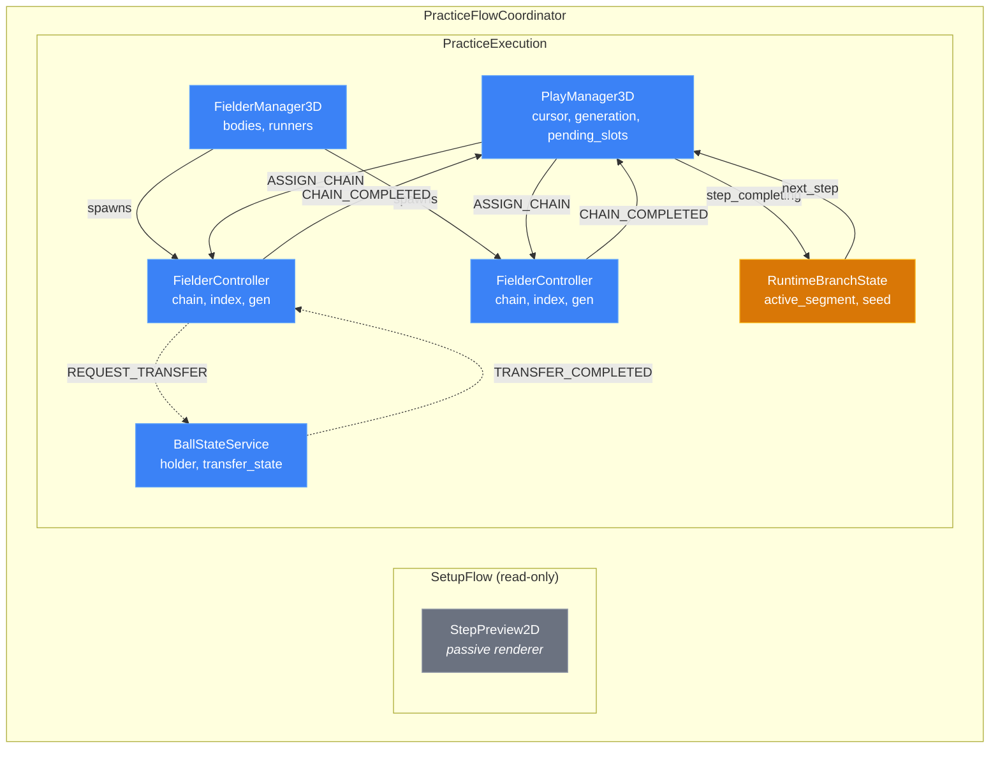
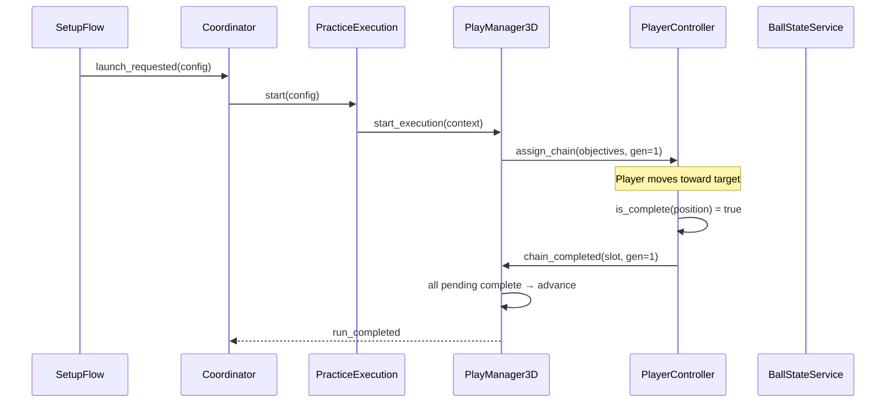
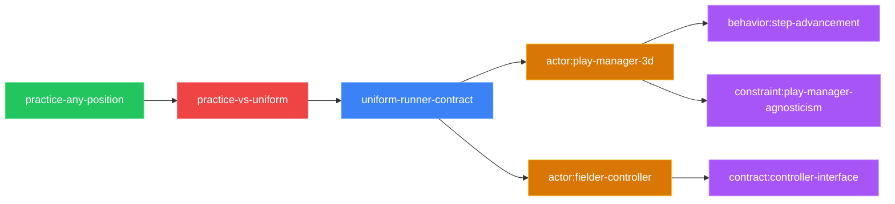

# Archwright Diagram

Generate Mermaid diagrams from archwright artifacts (domain models, patterns, specs). Produces version-controlled, GitHub-renderable visualizations.

**Core principle:** Diagrams are projections of the model — they don't add information, they make existing information comprehensible. If the model changes, diagrams update. If a diagram shows something not in the model, the model is incomplete.

## Diagram Types

### 1. Actor System Diagram

Shows all domain actors, their boundaries, owned state, and event flows.

**Use:** `graph TD` with subgraphs for composition boundaries.



**Conventions:**
- `subgraph` = composition boundary (lifecycle grouping)
- Solid arrows (`-->`) = command events (cause state change)
- Dashed arrows (`-.->`) = request events (may be rejected)
- Node content: `Name<br/>owned_state`
- `classDef` semantic colors: actor=blue, observer=gray, policy=gold
- Direction: `TD` (top-down) for hierarchy, `LR` for pipelines

### 2. State Machine Diagram

Shows one actor's internal states, transitions, guards, and invariants.

**Use:** `stateDiagram-v2`

```mermaid
stateDiagram-v2
    [*] --> Idle
    Idle --> Advancing : START_EXECUTION
    Advancing --> WaitingForCompletion : chains_assigned
    WaitingForCompletion --> WaitingForCompletion : CHAIN_COMPLETED [pending > 1]
    WaitingForCompletion --> Advancing : CHAIN_COMPLETED [last slot]
    Advancing --> RunComplete : cursor >= total_steps
    RunComplete --> [*]

    state WaitingForCompletion {
        note right of WaitingForCompletion
            INVARIANT: pending_slots non-empty
            INVARIANT: stale generation ignored
        end note
    }
```

**Conventions:**
- Guards in `[brackets]` after event name
- `note` blocks for invariants (what must be true IN this state)
- Composite states for orthogonal regions
- Keep to ≤8 states per diagram (split into sub-diagrams if larger)
- Name states as domain concepts, not implementation (`WaitingForCompletion`, not `_pending_check`)

### 3. Event Sequence Diagram

Shows a concrete scenario flowing through multiple actors.

**Use:** `sequenceDiagram`



**Conventions:**
- Order participants left-to-right by information flow
- Solid arrows (`->>`) for commands/events
- Dashed arrows (`-->>`) for responses/signals
- `Note over` for important state changes or invariants
- Keep to ≤12 messages per diagram (split long flows into phases)
- Title each diagram with the scenario name

### 4. Traceability Map

Shows the full chain: desire → tension → pattern → model → spec.

**Use:** `graph LR` (left-to-right pipeline)



**Conventions:**
- `LR` direction for pipeline/provenance flow
- Color by artifact type (consistent across all diagrams)
- Node text = artifact ID (short, linkable)
- One chain per desire (multiple chains = multiple diagrams)

## General Conventions

### Readability at Scale

- **≤15 nodes per diagram.** If more, split into sub-diagrams with cross-references.
- **Quote all labels with special characters:** `["Label with (parens)"]`
- **Consistent ID casing:** `PascalCase` for actors/components, `snake_case` for events/states
- **Direction per diagram type:** `TD` for hierarchies, `LR` for flows/pipelines, `TB` for state machines
- **Subgraph labels always quoted:** `subgraph id["Display Name"]`

### Styling

Dark-mode-first palette (high contrast on dark backgrounds, still readable on light):

```
%%{init: {'theme': 'dark'}}%%

classDef actor fill:#3b82f6,stroke:#60a5fa,color:#fff
classDef observer fill:#6b7280,stroke:#9ca3af,color:#fff
classDef policy fill:#d97706,stroke:#fbbf24,color:#fff
classDef desire fill:#22c55e,stroke:#4ade80,color:#fff
classDef tension fill:#ef4444,stroke:#f87171,color:#fff
classDef pattern fill:#3b82f6,stroke:#60a5fa,color:#fff
classDef spec fill:#a855f7,stroke:#c084fc,color:#fff
classDef data fill:#06b6d4,stroke:#22d3ee,color:#fff
```

Use these consistently across all archwright diagrams. The color carries meaning:
- **Blue** (`#3b82f6`) = domain actor (owns state, processes events)
- **Gray** (`#6b7280`) = observer (reads state, never writes)
- **Gold** (`#d97706`) = policy/strategy (injected decision logic)
- **Green** (`#22c55e`) = desire (product-level force)
- **Red** (`#ef4444`) = tension (conflict between forces)
- **Purple** (`#a855f7`) = spec (checkable commitment)
- **Cyan** (`#06b6d4`) = data contract (typed shape)

All fills use white text (`color:#fff`). Strokes are lighter tints of the fill for edge visibility on dark backgrounds. Add `%%{init: {'theme': 'dark'}}%%` as the first line of every diagram block.

### Anti-Patterns

- ❌ Diagrams that show information not in the model (diagrams are projections, not inventions)
- ❌ More than 15 nodes (split or summarize)
- ❌ Unquoted labels with special characters (breaks rendering)
- ❌ Color as only differentiator (add shape, label prefix, or grouping)
- ❌ Implementation details in architecture diagrams (show contracts, not code)
- ❌ Mixing diagram levels (don't put C4 Context and Component in one diagram)

## Does NOT

- Replace the domain model (diagrams are derived FROM the model, not independent)
- Generate code (visual only)
- Produce binary image files (text-based Mermaid rendered at view time)
- Own the data (if model.yaml changes, re-generate diagrams)

## Integration with Model Phase

The `archwright-model` skill calls on these conventions when producing its `.md` output. This skill can also be invoked standalone for:
- Visualizing existing specs/patterns for presentations
- Generating diagrams for ADRs
- Producing traceability maps across the full pipeline
