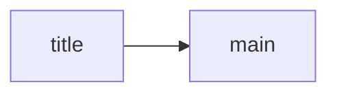

# Model Seed: UI Discovery

## Screen Flow

- title → main on START [wf-main#D001]
- main screen owns grid + tray state [wf-main#D003]
- spacing tokens constrain all layout containers [design-system#D002]

## Unconsumed decisions

- wf-main#D004 — feedback juice is a feel-finish concern; deferred to the polish pass, not modeled.

## Not Resolved Here

- [ ] Loading and empty states per wf-main
